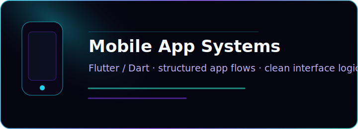
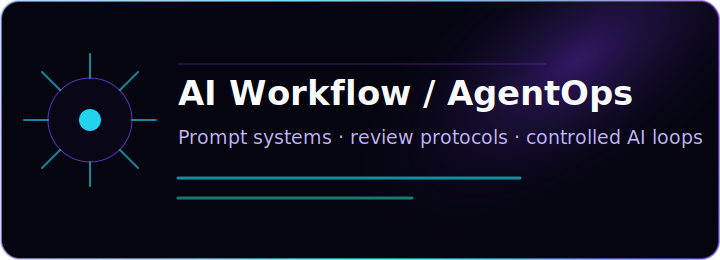
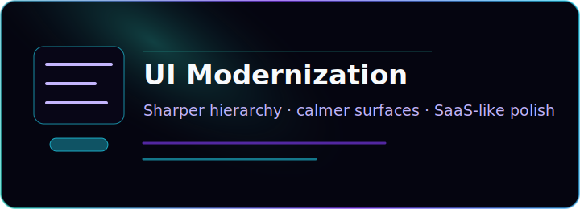
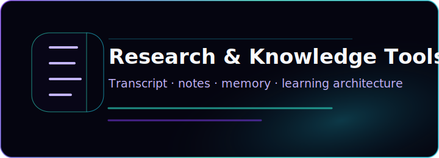

  

<h1 align="center">Syafiq / LizNoiree</h1>

  Building AI-assisted development workflows, mobile systems, and visual software experiences.

  <strong>Noire Core online · private systems, public craft.</strong>

  
  
  

  

  
<strong>Open: System Identity</strong>

  I build calm, structured software surfaces: mobile flows, AI-assisted engineering protocols, interface modernization experiments, and personal knowledge-kernel tooling.

  The Noire Core identity is a quiet developer interface: black glass, violet signal, cyan light, and geometric systems thinking. It is prepared for the future `LizNoiree` brand while staying grounded in the current `zetafiq` GitHub presence.

  
<strong>Open: What I Build</strong>

  

    
    
  

  

    
    
  

  **Mobile App Systems**  
  Flutter/Dart interfaces, structured app flows, clean screen logic, and practical mobile experience design.

  **AI Workflow / AgentOps**  
  Prompt systems, review protocols, controlled AI-assisted development loops, and repeatable engineering habits.

  **UI Modernization**  
  Turning older interfaces into polished, readable, SaaS-like experiences with clearer navigation and calmer visual hierarchy.

  **Research & Knowledge Tools**  
  Transcript, notes, memory, and learning systems designed for focus, recall, and long-term personal knowledge work.

  
<strong>Open: Current Focus</strong>

  - Flutter / Dart mobile app development
  - AI-assisted development workflows
  - GitHub, Codex, Claude, Gemini, and Perplexity workflow experiments
  - UI/UX modernization
  - Knowledge systems and memory architecture
  - Clean documentation and repeatable engineering workflows

  
<strong>Open: Tech Constellation</strong>

  **Mobile & UI**  
  
  
  

  **Web & Systems**  
  
  
  
  

  **Workflow**  
  
  
  
  

  
<strong>Open: Project Signals</strong>

  **KernelScribe**  
  `private / coming soon`  
  Local research and transcript workflow tooling for turning long-form input into structured notes and reusable knowledge.

  **LizKernel**  
  `private / public-safe summary`  
  A personal AI workflow and kernel library concept for controlled review loops, memory architecture, and repeatable development protocols.

  **UI Modernization Experiments**  
  `practice / public-safe summary`  
  Enterprise-style interface redesign practice focused on hierarchy, legibility, navigation, and polished product surfaces.

  **Mobile App Systems**  
  `in progress / public-safe summary`  
  Flutter-based app experience and workflow practice, centered on practical screens, clean state flow, and maintainable interaction patterns.

  
<strong>Open: Contact / Links</strong>

  - Portfolio: coming soon
  - LinkedIn: TODO
  - Email/contact: TODO
  - GitHub: [github.com/zetafiq](https://github.com/zetafiq)

  

  <strong>Noire Core online · building quietly, shipping carefully.</strong>

